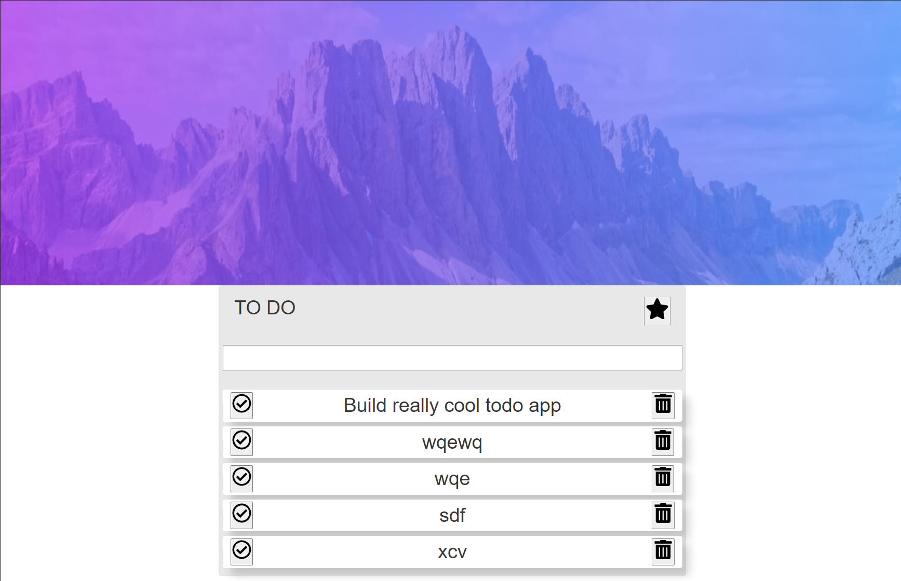
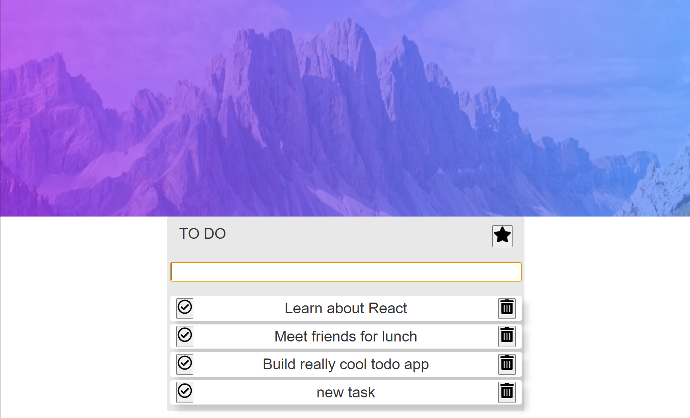
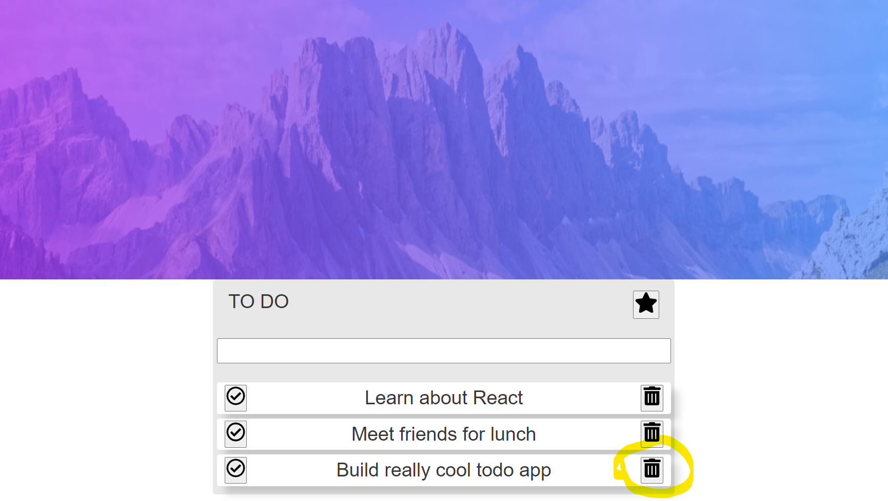
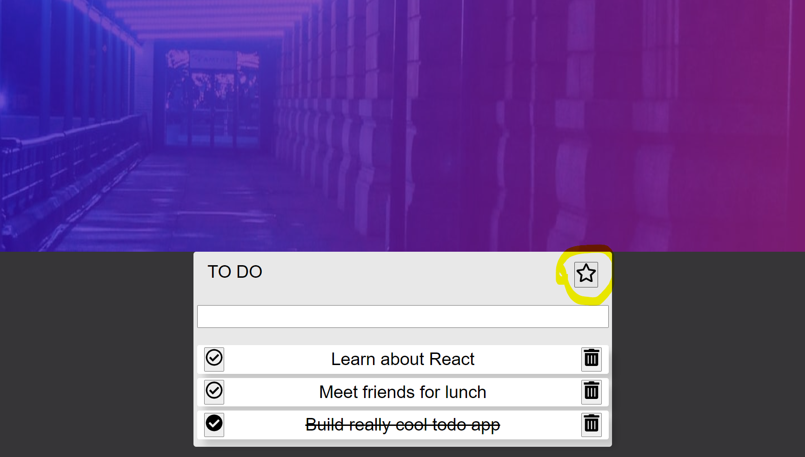

# ToDo APP React (Hooks)

Продакшен версия: [Live version](https://todo-hooks-git-main.saint-fons.vercel.app/)

## Технологии;
### React + Hooks, SASS/SCSS, Styled Components

##Функционал;
* Добавление задач (enter)
* Удаление задач
* Статус "Завершено для задачи"
* Переключение темы по иконке "Звезда" (ThemeProvider)

## Структура приложения;

### npm install / yarn install для установки node_modules
### npm start / yarn start для запуска проекта
### npm build / yarn build для продакшен версии

## I. Главная страница проекта

## II. Добавление новой задачи "new task"

## III. Задачи удаляются при нажатии соответствующего значка. Пример для задачи "new task" после удаления

    
## IV. При нажатии соответствующего значка, задача, считается выполненной.

    
##
    
